# 🔐 Cisco Secure Network

A hands-on **Cisco Packet Tracer** project focused on VLAN segmentation, VTP, 802.1Q trunking, SSH, VLAN isolation, and Layer 2 Port Security.

## 🎯 Project Objective

The goal was to build a segmented LAN and secure access ports against unauthorized devices.

## 🗺️ Network Topology

The network contains two Cisco switches and six PCs divided into three departments:

| VLAN | Department |
| ---- | ---------- |
| 10   | IT         |
| 20   | HR         |
| 30   | Finance    |

**Figure 1: LAN Network Topology Using Cisco Packet Tracer**

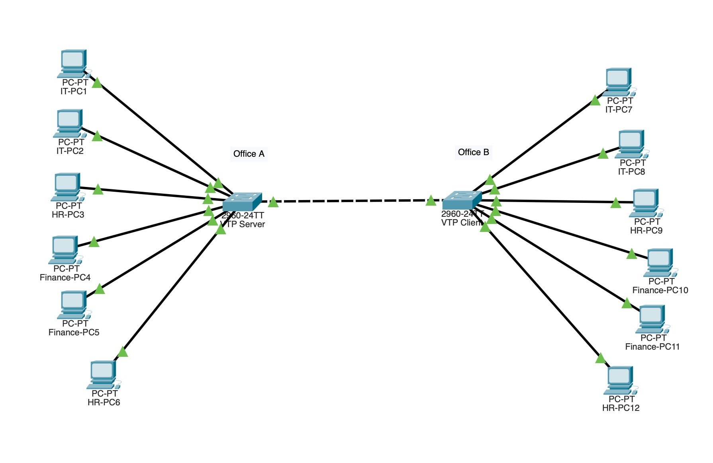

---

## ⚙️ VLAN & VTP Configuration

VLANs 10, 20, and 30 were created and assigned to the appropriate access ports.

```bash
show vlan brief
```

**Figure 2: VLAN Configuration on SW1**

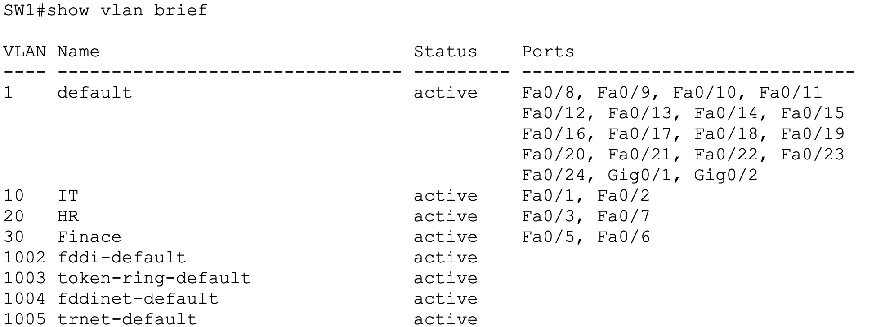

VTP was configured to synchronize VLAN information between the switches:

* **SW1:** VTP Server
* **SW2:** VTP Client
* **Domain:** `OFFICE`

```bash
show vtp status
```

**Figure 3: VTP Server Configuration on SW1**

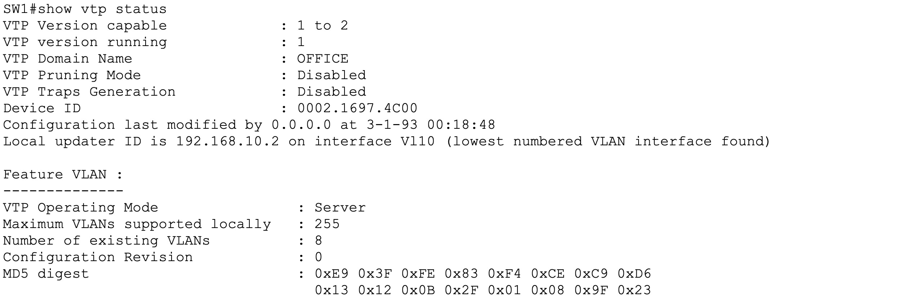

**Figure 4: VTP Client Configuration on SW2**

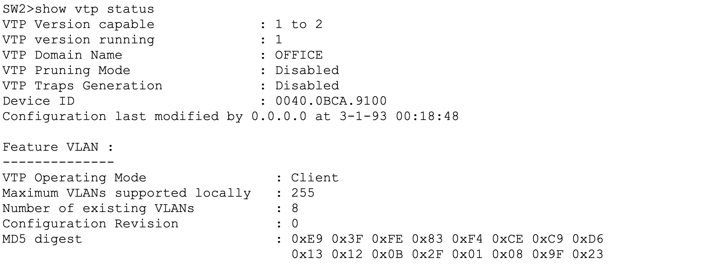

---

## 🔗 Trunking & Management

The link between SW1 and SW2 was configured as an **802.1Q trunk**, allowing VLANs 10, 20, and 30 to pass between the switches.

```bash
show interfaces fa0/4 switchport
```

**Figure 5: 802.1Q Trunk Configuration**

**SW1**

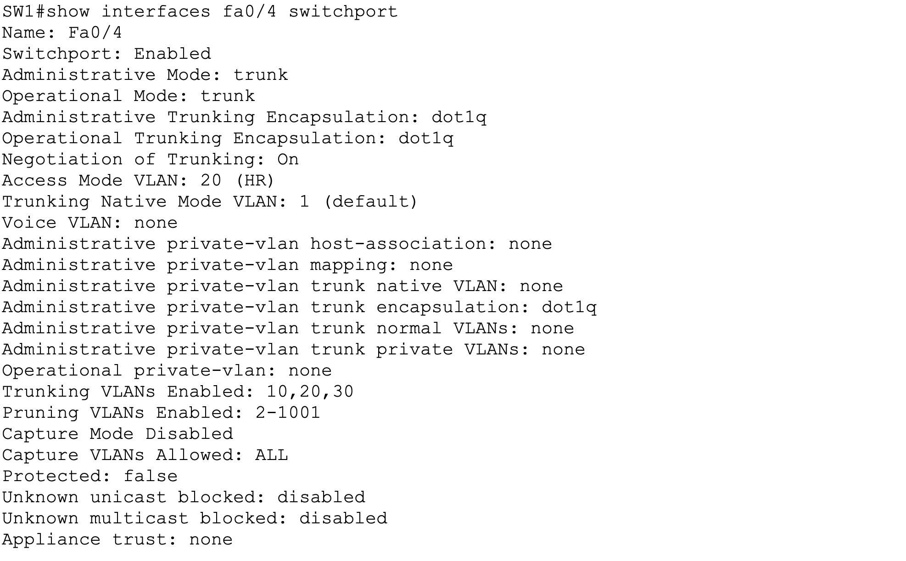

**SW2**

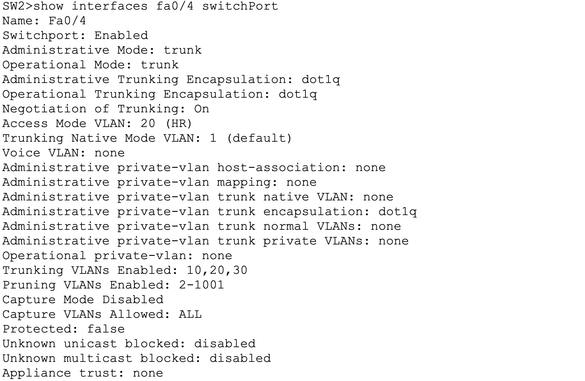

Management IPs were configured on VLAN 10:

* **SW1:** `192.168.10.2/24`
* **SW2:** `192.168.10.3/24`

```bash
show ip interface brief
```

**Figure 6: Management IP Configuration on SW1**

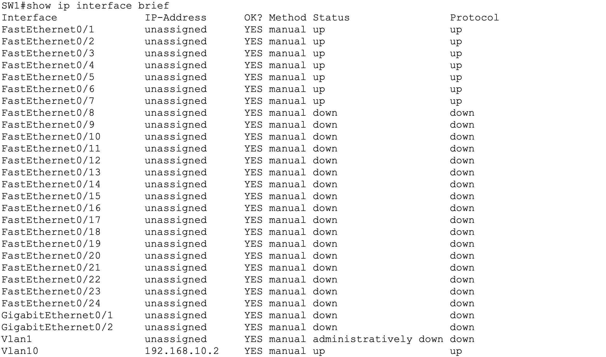

---

## 🔐 SSH Remote Management

SSH was configured and successfully tested by accessing SW1 remotely from SW2.

```bash
ssh -l admin 192.168.10.2
```

**Figure 7: Successful SSH Remote Access**

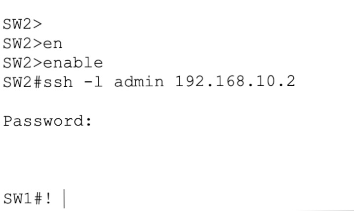

---

## 🧪 Switch Connectivity Testing

A ping test was performed from **SW1 to SW2** to verify connectivity between the two switches.

```bash
ping 192.168.10.3
```

**Figure 8: Successful Ping Test from SW1 to SW2**

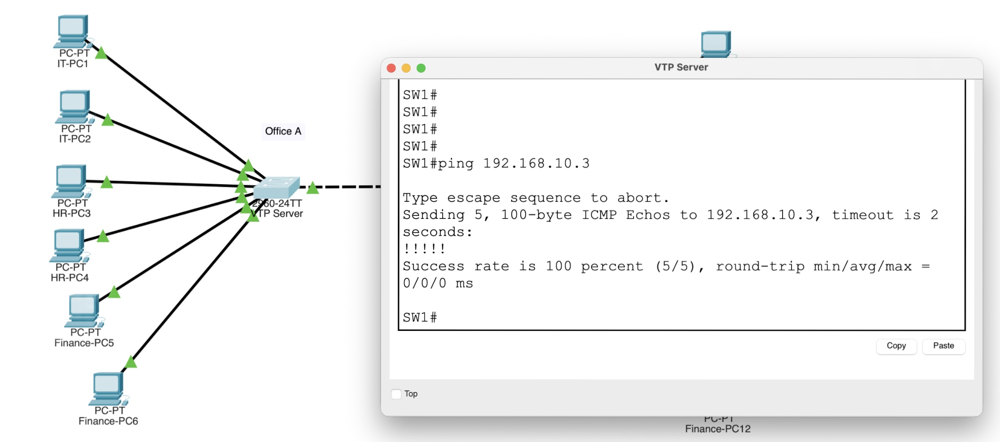

---

## 🧪 VLAN Connectivity & Isolation Testing

**Figure 9: VLAN Connectivity & Isolation Test**

Devices within the same VLAN can communicate successfully, while communication between IT (VLAN 10) and HR (VLAN 20) is blocked.

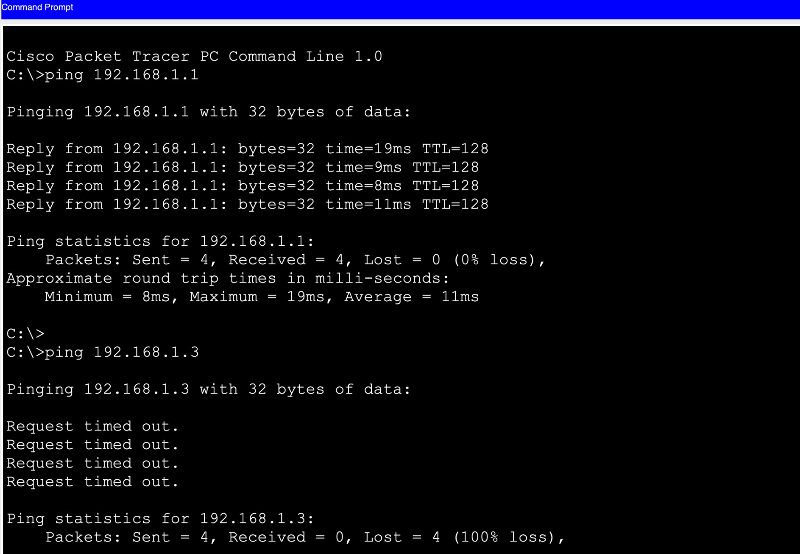

---

## 🚨 Port Security Test

Port Security was configured using **Sticky MAC**, with a maximum of **1 MAC address per port** and **Shutdown** violation mode.

The switch learned the authorized device's MAC address using **Sticky MAC**.

```bash
show port-security address
```

**Figure 10: Secure Sticky MAC Address Table**

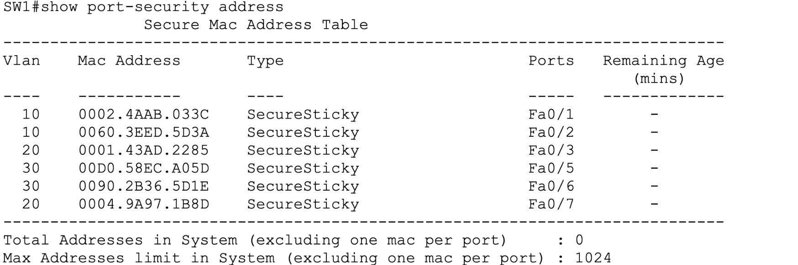

A different PC was connected to **Fa0/1** after the authorized device's MAC address had been learned.

The switch detected the unauthorized MAC address and, because the violation mode was set to **Shutdown**, automatically disabled the port and changed its status to **Secure-shutdown**.

The **Security Violation Count: 1** confirmed that the unauthorized device was detected and blocked.

```bash
show port-security interface fa0/1
```

**Figure 11: Port Security Violation**

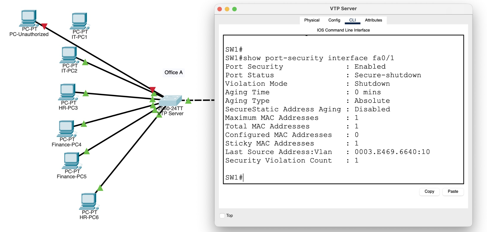

**Result:** Port Security successfully allowed the authorized device and blocked the unauthorized device.

### 🔄 Port Recovery

After removing the unauthorized device, the port was re-enabled for the authorized device.

```bash
interface fa0/1
shutdown
no shutdown
```

**Figure 12: Port Recovery**

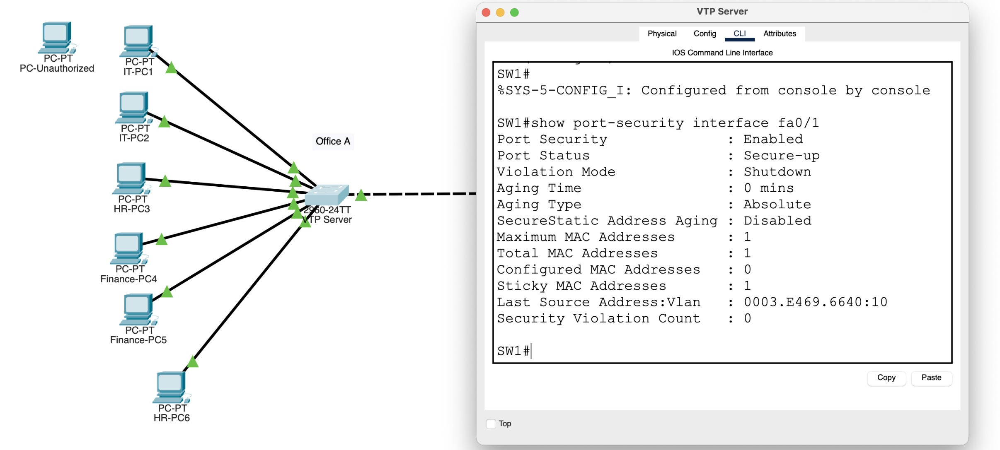

The port returned to **Secure-up**, allowing the authorized device to access the network again.

---

## 🏁 Result

The network was successfully configured, tested, and secured.

The project demonstrates practical implementation of **VLAN segmentation, VTP, 802.1Q trunking, SSH, switch connectivity testing, VLAN isolation, Sticky MAC Port Security, security violation handling, and port recovery**.


